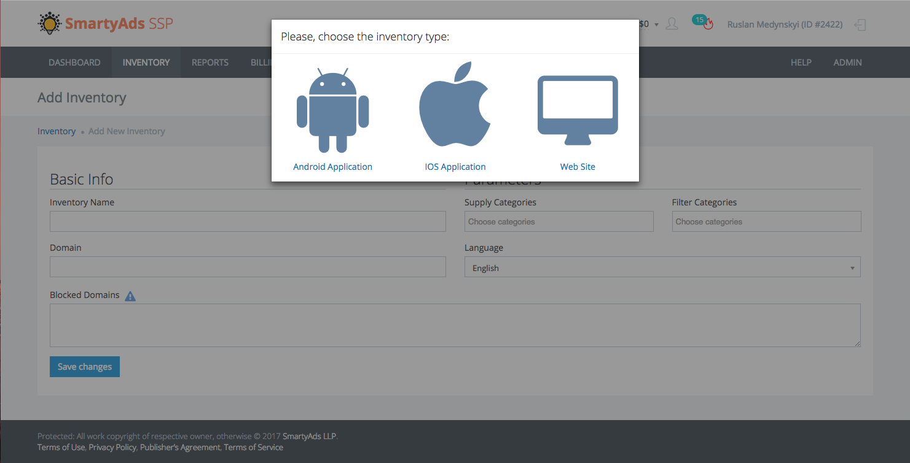
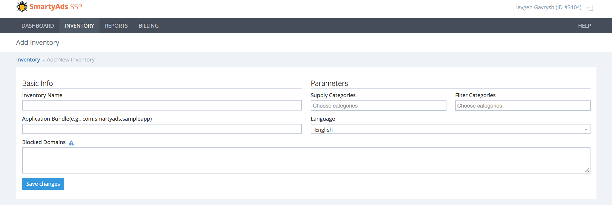
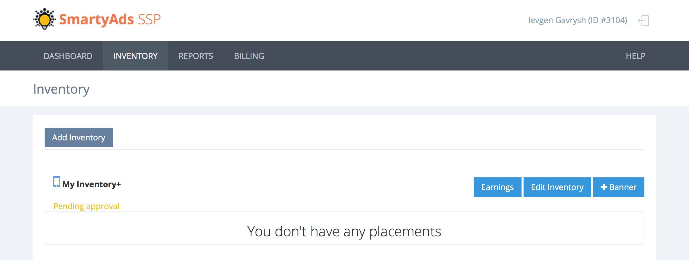
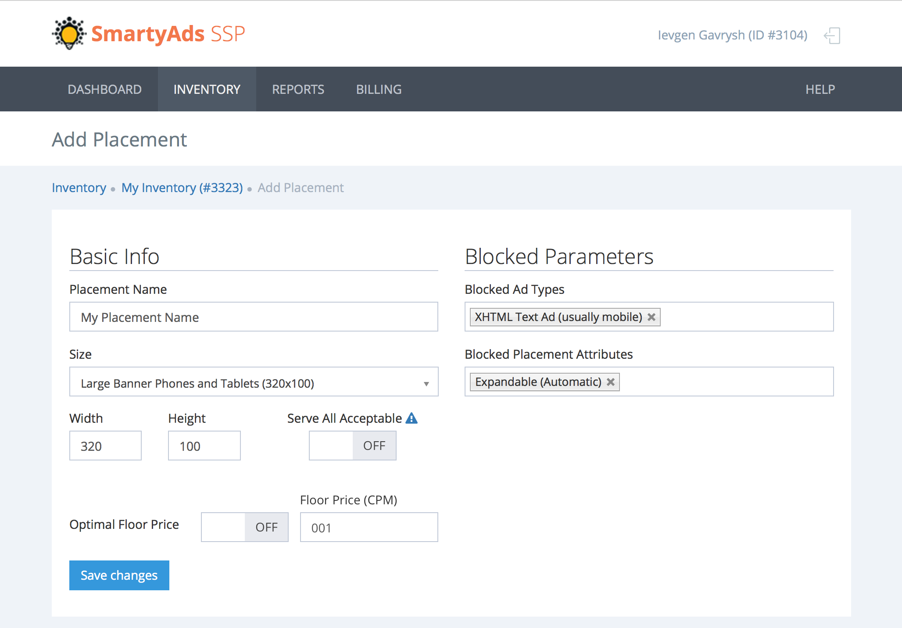
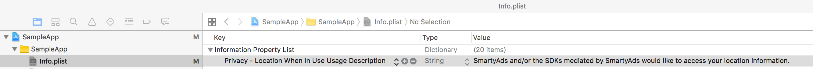
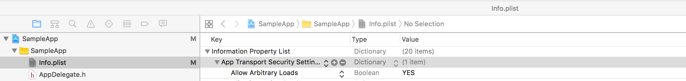
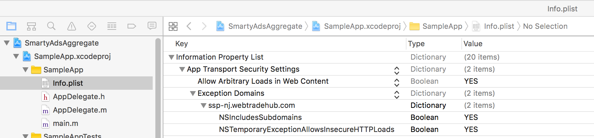

<p align="center">
	<a href="https://github.com/SmartyAdsSDK/ads-ios-sdk"></a><br />
	<br />
	iOS SDK for in-app advertising with SmartyAds Supply Side Platform
	<br />
</p>

> This is a free Software Development Kit for the iOS application developers and publishers to monetize digital mobile inventory faster than the blink of an eye. SmartyAds SDK integrates with [SmartyAds SSP](http://ssp.smartyads.com/login),  a one single source of offerings tailored to publishers’ needs

## Supported Ad formats

| Format | Ad View |
| :------------- | :------------- |
| <h4>320x50 Standard Banner</h4>       | |
| <h4>320x100 Large Banner</h4>        |  |
| <h4>300x250 IAB Medium Rectangle</h4>        ||
| <h4>468x60 IAB Full-Size Banner</h4>        |  |
| <h4>728x90 IAB Leaderboard</h4>       |  |

## Requirements

SmartyAdsSDK iOS in-app advertising framework requires _**iOS 8 and up**_.

## Quick Jumps to

[Getting Started](#getting-started)

[Installation](#installation)

[Setup App Permissions](#setup-app-permissions)

[Initializing SmartyAdsSDK](#initializing-smartyadssdk)

[Supported Banner Types & Size Constants](#supported-banner-types-and-size-constants)

[Banner Load & Presentation](#banner-load-and-presentation)

[Driving SMABannerAdView](#driving-smabanneradview)

[Advanced Ad Lifecycle](#advanced-ad-lifecycle)

[Contact Us](#contact-us)

## Getting Started

Just a few steps to start:

1. Register your account on [SmartyAds SSP](http://ssp.smartyads.com/login)  (http://ssp.smartyads.com)

2. Confirm your registration by following the confirmation link sent via email

3. Create your first mobile inventory by clicking `Add Inventory`. Select `iOS Application` in pop up.


4. Fill all required fields in `Add Inventory` form. Inventory should be reviewed and approved before presenting ads. Click `Save changes` for proceeding next


5. After this, you will be granted access to create placements for your inventory, `+Banner` button should become clickable


6. Click on `+Banner`, add the targeting options, floor price and size of your placement, then click `Save changes`


7. Please, note the _**Placement ID**(e.g., ID#5884)_ below it's title. It will be used later in your code to initialize the ad container


## Installation

* Download SmartyAdsSDK Cocoa Touch framework: https://github.com/smartyads/ads-ios-sdk/SmartyAdsSDK/SmartyAdsSDK.framework

* Place SmartyAdsSDK.framework in project's folder

* In XCode, choose your **App Target**: General -> Embedded Binaries -> Add SmartyAdsSDK.framework from the folder where it was placed on the previous step

## Setup App Permissions

Edit your Info.plist file to include the following properties:
* Add SMABundleIsPaid property and its Boolean value:
  - YES - if your App is paid, or you have in-app purchases
  - NO - if your App is distributed free of any charges


* *OPTIONAL* **Add Privacy - Location When In Use Usage Description** property with a String value: *SmartyAds and/or the SDKs mediated by SmartyAds would like to access your location information* to allow [companyName] SDK use Device location for geo ad targeting:
  * IN XCode:
  
  * OR by opening Info.plist and adding following properties:
  ```xml
  <?xml version="1.0" encoding="UTF-8"?>
  <!DOCTYPE plist PUBLIC "-//Apple//DTD PLIST 1.0//EN" "http://www.apple.com/DTDs/PropertyList-1.0.dtd">
  <plist version="1.0">
  <dict>
    ...
  <key>NSLocationWhenInUseUsageDescription</key>
  	<string>SmartyAds and/or the SDKs mediated by SmartyAds would like to access your location information.</string>
    ...
  </dict>
  </plist>
  ```

* Turn on **App Transport Security** flag. This is needed for receiving Ad View content via HTTP protocol. Although this step is not required, without it, you won't be able to receive Ad View content from advertisers which use HTTP references for resources in its content:
  * TURN ON **App Transport Security - Allows Arbitrary Loads** property - this option will allow ad content loading via **HTTP** protocol. In order to turn turn on this property do the following:
    * IN XCode:


    * OR by opening **Info.plist** and adding following properties:
```xml
<?xml version="1.0" encoding="UTF-8"?>
<!DOCTYPE plist PUBLIC "-//Apple//DTD PLIST 1.0//EN" "http://www.apple.com/DTDs/PropertyList-1.0.dtd">
<plist version="1.0">
<dict>
  ...
  <key>NSAppTransportSecurity</key>
  <dict>
    <key>NSAllowsArbitraryLoads</key>
    <true/>
  </dict>
  ...
</dict>
</plist>
```
  * ALTERNATIVELY, you can use **App Transport Security - Allows Arbitrary Loads In Web Content** property - this option will allow web content loading via **HTTP** protocol. Also add *ssp-nj.webtradehub.com* to **Exception Domains** dictionary. In this case you should also define `-shouldCheckAdLinks` for **SMABannerAdViewDelegate** to return NO, so that HTTP links check won't fail in general case. [More Details](https://github.com/smartyads/ads-ios-sdk/wiki#Advanced%20Ad%20Lifecycle):
    * IN XCode:

    * OR by opening **Info.plist** and adding following properties:
```xml
<?xml version="1.0" encoding="UTF-8"?>
<!DOCTYPE plist PUBLIC "-//Apple//DTD PLIST 1.0//EN" "http://www.apple.com/DTDs/PropertyList-1.0.dtd">
<plist version="1.0">
<dict>
  ...
	<key>NSAppTransportSecurity</key>
	<dict>
		<key>NSExceptionDomains</key>
		<dict>
			<key>ssp-nj.webtradehub.com</key>
			<dict/>
			<key>NSExceptionAllowsInsecureHTTPLoads</key>
			<true/>
			<key>NSIncludesSubdomains</key>
			<true/>
		</dict>
		<key>NSAllowsArbitraryLoadsInWebContent</key>
		<true/>
  ...
</dict>
</plist>
```

## Initializing SmartyAdsSDK

In AppDelegate.m, `-application:didFinishLaunchingWithOptions:` method add following initializing code :
```objective-c
#import <SmartyAdsSDK/SmartyAdsSDK.h>

...

- (BOOL)            application:(UIApplication *)application
  didFinishLaunchingWithOptions:(NSDictionary *)launchOptions
{
    [SmartyAds start];

    return YES;
}
```

## Add Banner
In **View**/**ViewController** where you want to show Banner, add **SMABannerAdView** property as a class var:
```objective-c
#import <SmartyAdsSDK/SmartyAdsSDK.h>

@interface ViewController ()
@property (nonatomic, strong) SMABannerAdView *adView;

@end
```

Use `-init`,`-initWithFrame:`, or `-viewDidLoad` as a place for **adView** initialization:
```objective-c
- (instancetype)init {
  self = [super init];

  self.adView = [[SMABannerAdView alloc] initWithPlacementId:**your_banner_id_here** size:**your_banner_size_here**];
  [self.view addSubview:self.adView];

  return self;
}
```

#### Important

Do not forget to replace the **your_banner_id_here** with the placement ID from the Platform(Step 6 of the Getting Started section, e.g. @"5884") and **your_banner_size_here** (e.g. kSMAAdSizeBanner) accordingly. See the sample code below:

```objective-c
[[SMABannerAdView alloc] initWithPlacementId:**your_banner_id_here** size:**your_banner_size_here**];
```

## Supported Banner Types and Size Constants

SmartyAdsSDK supports five Banner Sizes. Your should choose size to pass in initialization(**your_banner_size_here**) accordingly to selected placement type on [SmartyAds SSP](http://ssp.smartyads.com/login):

| Size, DPI| Type    | SmartyAdsSDK Size Constant |
| :------------- | :------------- | :------------- |
| 320x50       | Standard Banner       | kSMAAdSizeBanner       |
| 320x100       | Large Banner       | kSMAAdSizeLargeBanner       |
| 300x250       | IAB Medium Rectangle       | kSMAAdSizeIABMediumRectangle       |
| 468x60      | IAB Full-Size Banner       | kSMAAdSizeIABFullSizeBanner      |
| 728x90       | IAB Leaderboard      | kSMAAdSizeIABLeaderBoard       |

## Banner Load and Presentation

In order to load and show banner, you should call `-load` method. Load should be called when view is already shown, so we are sure that ad will be shown to the actual user. The most optimal place is `-viewWillAppear` method:
```objective-c
- (void)viewWillAppear {
  [self.adView load];
}
```

## Driving SMABannerAdView

SMABannerAdView serves the following methods for Ad View management:
* `-load` - loads and presents Ad View

* `-cancelLoad` - cancels Ad View load

* `-forceRefreshAd:` - cancels current load and refreshes Ad View

* `-startAutomaticallyRefreshingContentsWithTimeInterval:` - loads and starts refreshing Ad View periodically, after time interval parameter, passed into method. Minimal refresh interval is 20 seconds

* `-stopAutomaticallyRefreshingContents` - stops previously initiated auto refresh process

* `-adConsumerInfo` - retrieved user info **NSDictionary** which is sent to SSP as parameters for ad request

## Advanced Ad Lifecycle

In order to provide advanced Ad View logic you can use **SMABannerAdViewDelegate** delegation mechanism. In order to do so, set **delegate** property in **SMABannerAdView** instance:
```objective-c
@interface ViewController () <SMABannerAdViewDelegate>
@property (nonatomic, strong) SMABannerAdView *adView;

@end

@implementation ViewController

- (instancetype)init {
  self = [super init];

  self.adView = [[SMABannerAdView alloc] initWithPlacementId:**your_banner_id_here**
                                                        size:**your_banner_size_here**];
  self.adView.delegate = self;
  [self.view addSubview:self.adView];

  return self;
}

@end
```

Now, you can define the following methods of **SMABannerAdViewDelegate** protocol:
* `-adViewWillLoad:` - fires to notify of upcoming ad view load

* `-adViewDidLoad:` - fires when Ad View is successfully loaded

* `-adView:didFailLoadingWithError:` - fires when Ad View failed to load

* `-adViewWasClicked:` - fires when user clicked Ad View

* `-adViewWillLeaveApplication:` - fires when user is about to leave screen with Ad View, e.g. Home button is pressed

* `-shouldRequestPreciseLocation` - asks if Ad View can request geo location, by using device location services, YES by default

* `-shouldCheckAdLinks`  - asks if Ad View should check received Ad content, e.g. checking resources availability, before showing Ad to user. If content is broken Ad View won't show ad to user. YES by default

## Contact Us

`ievgen@smartyads.com`

Partnership, legal issues, other inquiries: `publishers@smartyads.com`

[SmartyAds SSP](http://ssp.smartyads.com/login)

[SmartyAds](http://smartyads.com)
